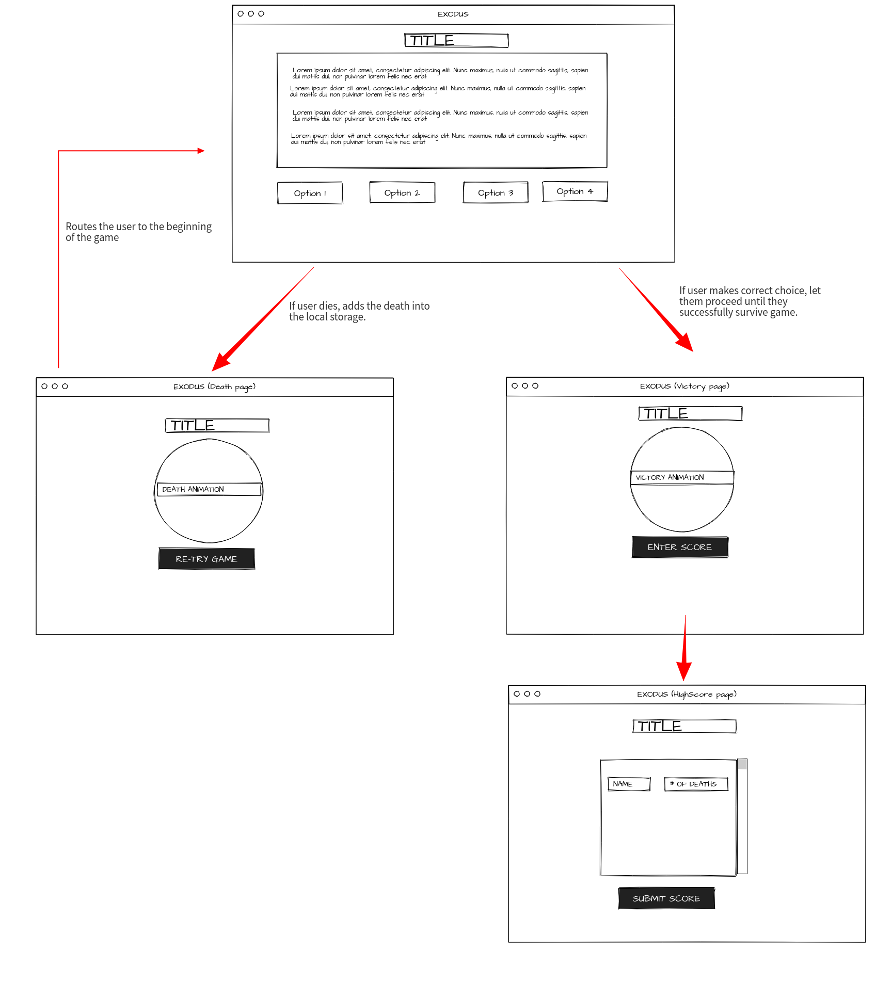
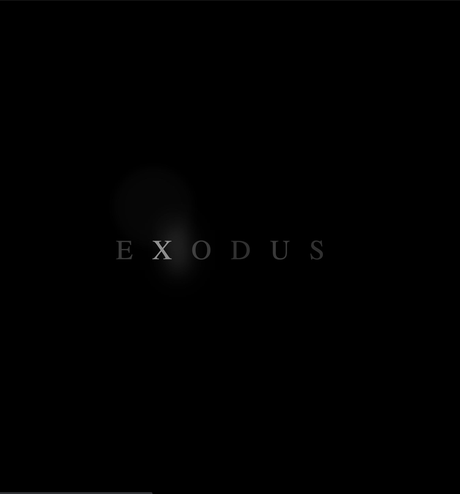
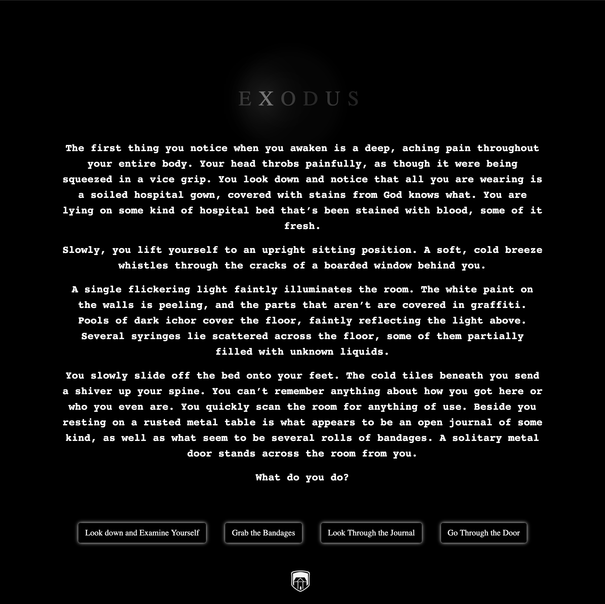
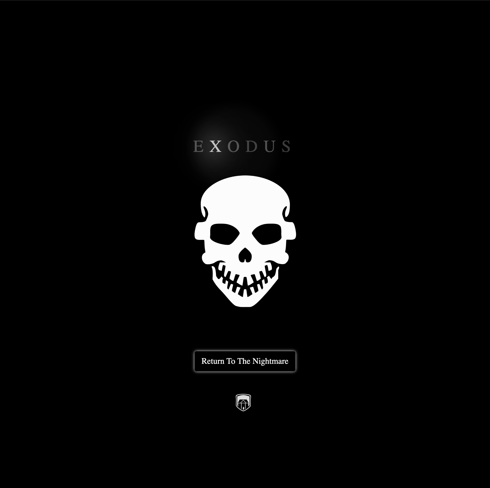
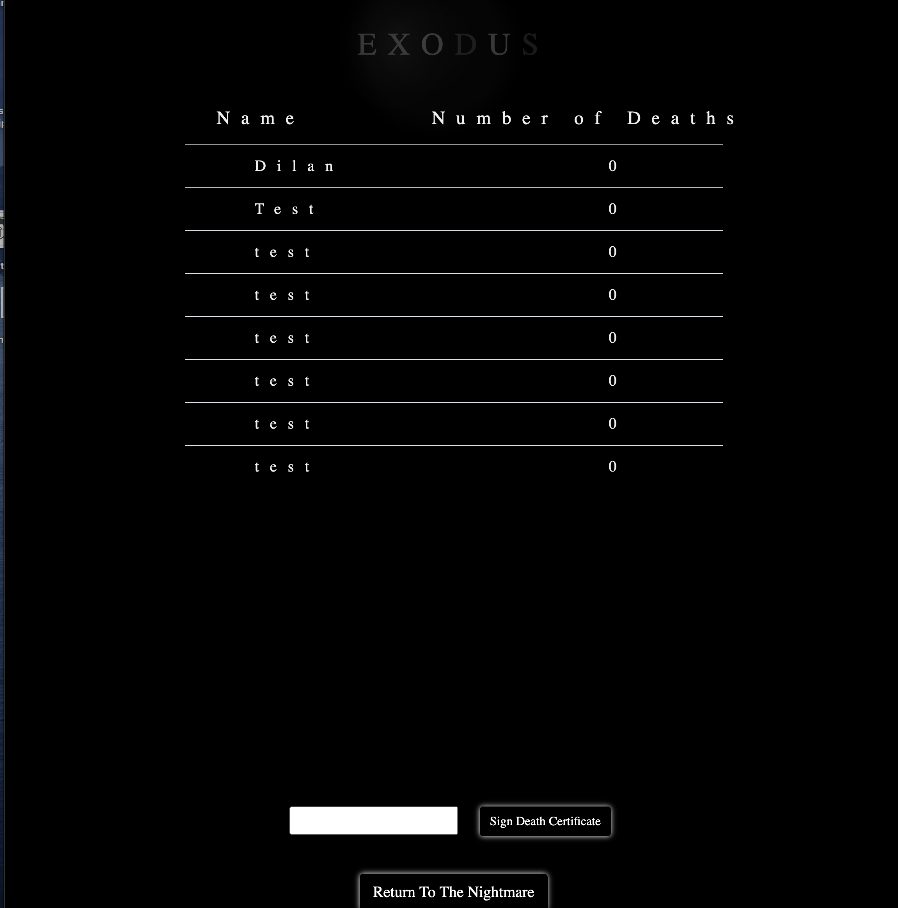

# Project_Exodus

# Table of Contents 
1. [Description](##Description)
2. [Elevator Pitch](##Elevator_Pitch)
3. [Team](##Team)
4. [Issues and Resolutions](##Issues_And_Resolutions)
5. [Credits](##Credits)
6. [Future Development](##Future_Development)
8. [Wireframe](##Wireframe)
8. [Link](##Link)
9. [Screenshot](##Screenshot)

## Description 
Exodus is a choose-your-own-adventure application, taking the retro game concept and giving it a sleek, refined front end experience. This group project utilizes sequelize, express, handlebars,  mySQL, Bootstrap as well as multiple css libraries. 

Upon accessing the application the user will be presented with a flickering title, and upon clicking it they will be brought into the game. Finding themselves trapped in a scene straight from a horror movie, the user will be given a series of prompts about what is going on and options about how they can interact. The goal for the user is to escape the house. 

If the user fails in their attempt they will be brought back to the beginning of the game, with their failure being recorded in the local storage. 

Upon successfully escaping the house the user will be allowed to record their name in the highscore table, which will take their recorded number of failed attempts and automatically post it alongside. 

## Elevator_Pitch
Retro is having a comeback. We see it in clothing, in film, in music, why not games? Team Undefined took this craze and applied it to our choose-your-own adventure game: EXODUS. Evoking memories of classic horror alongside a front-end design that is sleek in its simplicity, we built EXODUS to entertain and thrill the user as they attempt to escape a nightmarish imprisonment.  

## Team
1. Front End 
    * Wyatt Hancock and Jameson Midgley 
2. Backend
    * Dilan Lee, Rajesh Baduwal and Sam Greilick 
3. Story Builder 
*   Ammon Jeffery 

## Issues_And_Resolutions 
- With the front end we had a lot of complicated css effects occuring at the same time on different objects or lines of text, and sometimes these effects could interfere with one another. In order to fix this we had to seperate a lot of the effects into seperate css files and only allow for the effects to be trigged in certain instances with javascript. 
- Making sure the Continous Integration and Continous Deployment process was not interrupted with every commit was a big learning curve.Merging only the final and fully functional codes to the master branch was very critical to make sure CI is occuring smoothly. 

## Credits 
* Aakhya Signh for creating the typewriter css and js effect:
    - [Link To Codepen](https://codepen.io/aakhya/pen/NErZry)
* Prathamesh Koshti for creating the LIGHT flickering animation: 
    - [Link To Codepen](https://codepen.io/prathameshkoshti/pen/PVVRMG)
* Mateusz Rybczonec and Geoff Graham for creating the Timer Animation:
    - [Link to Codepen](https://codepen.io/geoffgraham/pen/yLywVbW)
* Tremaine Eto for explaining how to create a fade in and out effect with css:
    - [Link to Website](https://medium.com/cloud-native-the-gathering/how-to-use-css-to-fade-in-and-fade-out-html-text-and-pictures-f45c11364f08)

## Future_Development
* One thing that we'd like to accomplish with future iterations of this application is to expand out the house. Due to us only having two weeks to accomplish this project we focused on only five rooms to prove the concept. To flesh out the story we'd like to have over twenty rooms, situated in an upstairs, main floor, and basement. 

## Wireframe:

## Link 
[Deployed Website](https://exodus-escape.herokuapp.com/)

## Screenshot 

